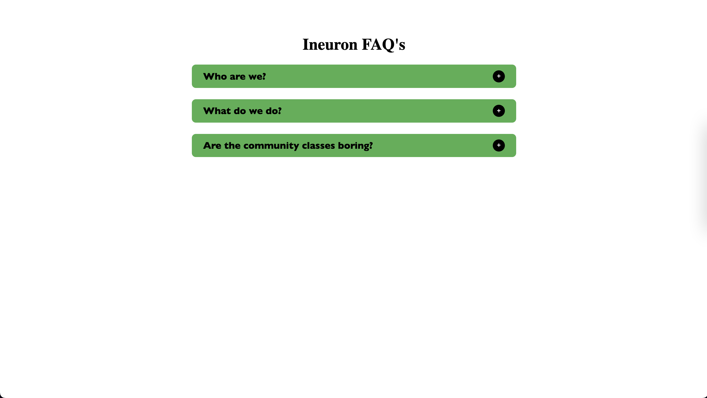

# Accordion-JavaScript-Project-FSJS-iNeuron

## About

This project is build using Javascript.

## ⚙️ What did I learn by making this project?

- JavaScript DOM manuplialtion.
- using for-of loop.

## ⌛ Time taken to finish this project?

This project took me around 1 hour to finish.

## 📷 Screenshots

